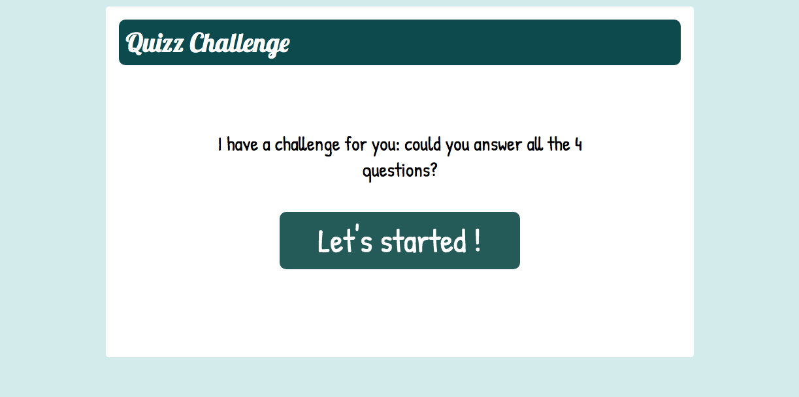
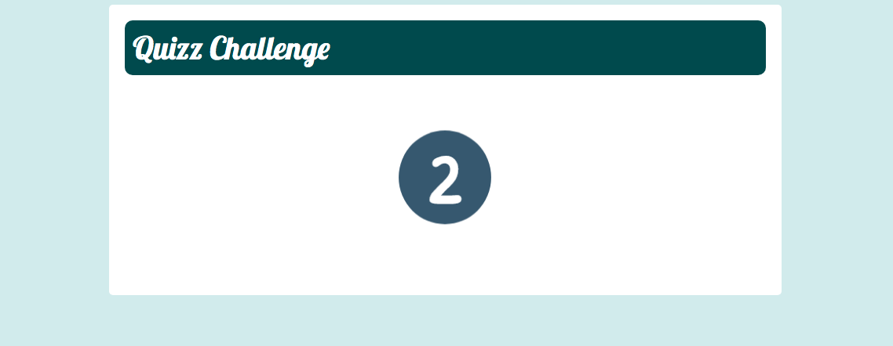
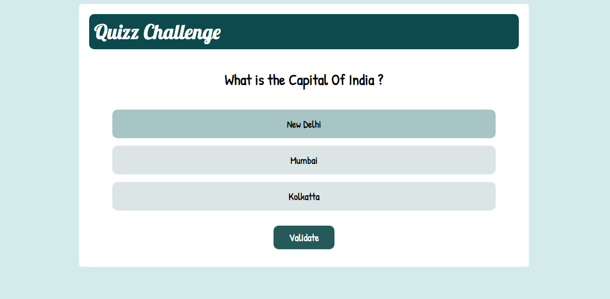
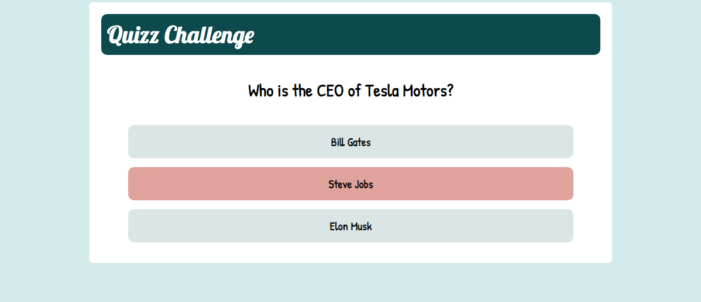
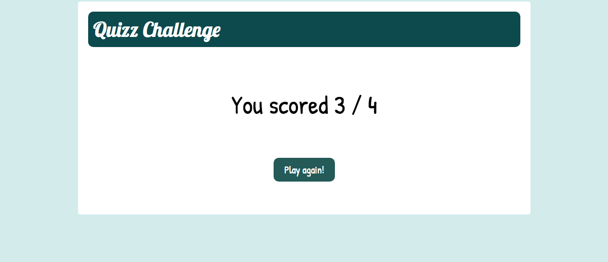

# quizz-challenge-react
Second App I developped: a quizz challenge with questions and animations

1/ Click on the start button

2/ A counter will appear...

3/ Answer questions

4/ After validate, you'll see if you are true or false

5/ Get youre score

